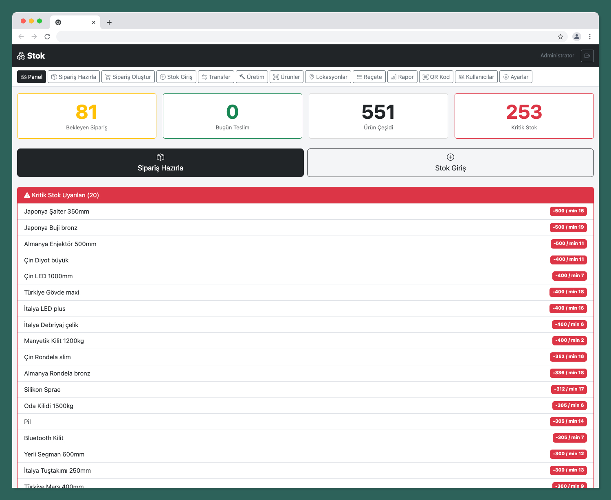

# Depo & Stok Yönetim Sistemi

Küçük, orta ölçekli e-ticaret depoları için geliştirilmiş, barkod tabanlı stok ve sipariş hazırlama sistemi. Web üzerinden gelen siparişlerin depo tarafında hatasız hazırlanmasını sağlar.



## Video

https://github.com/user-attachments/assets/5a06ec6c-76da-46cf-a8e8-ba9577c4b636

---

## Özellikler

- **Barkod Destekli** — Kamera ile tarama, EAN-13, Code128, QR Code
- **Stok Takibi** — Giriş/çıkış hareketleri, kritik stok uyarıları
- **Sipariş Hazırlama** — Barkodla kontrol, hata engelleme
- **Üretim Yönetimi** — BOM (Reçete) ile mamul üretimi
- **Lokasyon Yönetimi** — Depo gözleri, lokasyonlar arası transfer
- **Çoklu Kullanıcı** — Admin, Depocu, Muhasebe roller
- **Otomatik Kurulum** — Tek script ile kurulum, izinler otomatik

---

## Gereksinimler

- PHP 7.x+ (cPanel'de mevcut)
- SQLite3 PHP eklentisi
- HTTPS (iPhone kamera için zorunlu — Let's Encrypt ücretsiz)

---

## Kurulum

### 1. Dosyaları Yükle

FTP veya cPanel File Manager ile tüm dosyaları yükle:
- Kök dizin: `public_html/`
- Alt klasör: `public_html/depo/` (veya istediğin klasör)

### 2. Kurulum Scripti Çalıştır

Tarayıcıda aç:
```
https://siteadiniz.com/install/setup.php
```

Kurulum sırasında otomatik:
- Veritabanı klasörü oluşturulur
- `.htaccess` oluşturulur
- Tüm dosyalara izin verilir (644/755)
- Varsayılan lokasyonlar oluşturulur
- Admin kullanıcı oluşturulur

### 3. Giriş Yap

```
https://siteadiniz.com/login.php
```

**Varsayılan Giriş Bilgileri:**
- Kullanıcı: `admin`
- Şifre: `admin123`

**Kurulum bittikten sonra `install/setup.php` dosyasını sil!**

---

## Kullanım

### Ürün Ekleme (Admin)

1. Menü → Ürünler
2. Formu doldur: isim, barkod, kategori, min stok, ürün tipi (hazır/imalat/parça)
3. Kaydet

### Stok Girişi

1. Menü → Stok Giriş
2. Ürün barkodunu tara
3. Lokasyon seç (opsiyonel)
4. Miktar gir → Kaydet

### Transfer (Lokasyonlar Arası)

1. Menü → Transfer
2. Kaynak göz seç
3. Hedef göz seç
4. Ürün seç, miktar gir → Transfer Et

### Sipariş Oluşturma (Admin/Muhasebe)

1. Menü → Sipariş Oluştur
2. Sipariş no ve müşteri gir
3. Kalem ekle, ürün seç
4. Kaydet

### Sipariş Hazırlama (Depocu)

1. Menü → Sipariş Hazırla
2. Sipariş seç veya no gir
3. Her ürünü barkodla tara
   - ✅ Doğru → yeşil onay
   - ❌ Yanlış/fazla → uyarı
4. Tüm ürünler tamam → "Teslim Et"

### Üretim Emri (Admin)

1. Menü → Üretim
2. Mamul ürün seç (imalat tipi)
3. Miktar gir → Oluştur
4. Parçalar otomatik düşülür, mamul stok eklenir
5. İptal et → Parçalar stoka iade edilir

### Reçete (BOM) Tanımlama (Admin)

1. Menü → Reçete
2. Mamul ürün seç
3. Parça ekle, miktar belirle
4. Kaydet

### Lokasyon Oluşturma (Admin)

1. Menü → Lokasyonlar
2. Kat, Bölge, Raf aralığı, Göz sayısı gir
3. Oluştur → Toplu göz kodları üretilir

---

## Kullanıcı Rolleri

| Rol | İzinler |
|-----|---------|
| **Admin** | Tüm işlemler, ürün/ürün düzenleme, sipariş yönetimi |
| **Depocu** | Stok girişi, sipariş hazırlama, transfer |
| **Muhasebe** | Sipariş oluşturma, rapor görüntüleme |

---

## Teknoloji

| Katman | Teknoloji |
|--------|----------|
| Backend | PHP 7.x+ |
| Frontend | Bootstrap 5 + Vanilla JS |
| Veritabanı | SQLite 3 |
| Barkod/QR | html5-qrcode |

---

## Proje Yapısı

```
├── config/           # Yapılandırma
├── includes/         # Auth, Header, Footer, Functions
├── api/              # REST endpoint'ler (JSON)
├── pages/            # Sayfalar (products, orders, stock, locations...)
├── assets/           # CSS, JS
├── database/         # depo.sqlite
└── install/          # Kurulum scripti
```

---

## Lokasyon Kodları

```
K1-A-R1-G1 = 1. Kat / A Koridoru / Raf 1 / Göz 1
K2-B-R3-G2 = 2. Kat / B Koridoru / Raf 3 / Göz 2
```

---

## Lisans

MIT License
